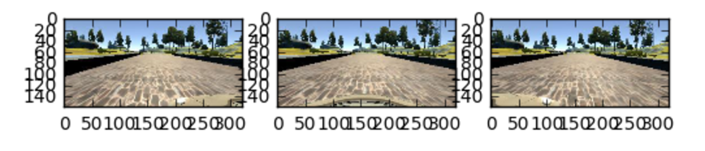

##Introduction

What I enjoy the most about participating in the Udacity Self-Driving Car Engineer Nanodegree is spending time implementing project assignments.  You can view my previous projects and write-ups [here](https://github.com/sunflora/CarND-LaneLines-P1) and [here](https://github.com/sunflora/CarND-Traffic-Sign-Classifier-Project).  

This third project is called "Use Deep Learning to Clone Driving Behavior." Udacity put together an awesome simulator that provides a game-like 
driving environment, where the driving behavior of a human player can be recorded and fed into
a deep learning network to learn how to drive.  After the network is properly trained, it will
have the ability to give instructions to the simulator on how to 'drive' the car autonomously.  

###How does it work under the hood?

Just like a human player makes decisions on how to maneuver the steering wheel of the car in the simulator by viewing the road conditions, on the computer screen, such as whether the road ahead is curving towards right or left; upon completion of our project, the neural network shall take input in the form of the series of images that the game is made out of and make decisons on which direction and/or how much to turn the steering wheel.  Specificially, each image is first pre-processed and then passed into the deep learning network, the network then calculates and output a steering angle based on the network architecture and the weights of the network.  
 
In this project, our goal is to build a deep learning model using Keras, a high-level neural networks
library running on top of Tensorflow, also an open source library for machine learning algorithms.
The base of the data is the set of images taken from a central camera mounted in the windshield of the car in the simulator as well as steering angle associated with each image.  

Here is an example of an image before any process has been done on it:


##Network Model

This project's direction to self-driving car is very similar to that of comma.ai, a project whose "approach to Artificial Intelligence for self-driving cars is based on an agent that learns to clone driver behaviors and plans maneuvers by simulating future 
events in the road."  Comma.ai's approach is described [here](https://arxiv.org/pdf/1608.01230v1.pdf)

I have adopted Comma.ai's CNN learning model presented on this [codebase]
 (https://github.com/commaai/research/blob/master/train_steering_model.py).

It is made up of three convolution layers, a flatten layer, two fully connected layer, and four
exponential linear units (ELUs) and two dropout layers as depicted below:


While these layers introduce nonlinearity into the model, data is normalized by the lamba layer
to [-0.5, 0.5].  Here is a table with more description on the network:


Most of the parameters defined in Comma.ai's train\_steering\_model.py works well for the project with one excption: the first dropout rate (p) was increased from 0.2 to 0.5.  The adjustment was made after discovering exploding gradients as well as overfitting occur quickly with the increase of the number of epochs. Another hyper-parameter that was set for the same reason is the learning rate.  It was set from 0.001, the default value by Keras, to 0.0001.  

###Phased Learning

Inspired by the transfer learning, I have designed the model.py to be able to train an existing
model.  I'd like to name this section "Incremental Learning" but that term is already taken in ML world.  This non-tabula rasa approach saved me some time working on this project.

Here is my training log.  As you can see in this particular training session, I ran the model.py five times, each time with epoch value of 25, 10, 5, 5, and 5.  Note that I have multiplied the steering value by 10 and
therefore you will see the loss number much larger (in fact, 100 times per mean square error) than without the modification.  In drive.py, the prediction values were divided by 10 prior to be sent to the simulator.

```
Buidling model from ground up...
Creating model ...
Creating model completed.
Training model ...
Epoch 1/25
38675/38675 [==============================] - 87s - loss: 2.8625 - val_loss: 2.4416
Epoch 2/25
38675/38675 [==============================] - 85s - loss: 2.3935 - val_loss: 2.2758
Epoch 3/25
38675/38675 [==============================] - 81s - loss: 2.2585 - val_loss: 2.1973
Epoch 4/25
38675/38675 [==============================] - 111s - loss: 2.1424 - val_loss: 2.0921
Epoch 5/25
38675/38675 [==============================] - 96s - loss: 2.0424 - val_loss: 1.9404
Epoch 6/25
38675/38675 [==============================] - 102s - loss: 1.9349 - val_loss: 1.9258
Epoch 7/25
38675/38675 [==============================] - 98s - loss: 1.8483 - val_loss: 1.8116
Epoch 8/25
38675/38675 [==============================] - 90s - loss: 1.7748 - val_loss: 1.7388
Epoch 9/25
38675/38675 [==============================] - 100s - loss: 1.7024 - val_loss: 1.7172
Epoch 10/25
38675/38675 [==============================] - 92s - loss: 1.6391 - val_loss: 1.6815
Epoch 11/25
38675/38675 [==============================] - 85s - loss: 1.5941 - val_loss: 1.6796
Epoch 12/25
38675/38675 [==============================] - 79s - loss: 1.5590 - val_loss: 1.6712
Epoch 13/25
38675/38675 [==============================] - 84s - loss: 1.5177 - val_loss: 1.5791
Epoch 14/25
38675/38675 [==============================] - 84s - loss: 1.4716 - val_loss: 1.5133
Epoch 15/25
38675/38675 [==============================] - 81s - loss: 1.4451 - val_loss: 1.5339
Epoch 16/25
38675/38675 [==============================] - 81s - loss: 1.4087 - val_loss: 1.5014
Epoch 17/25
38675/38675 [==============================] - 80s - loss: 1.3922 - val_loss: 1.4751
Epoch 18/25
38675/38675 [==============================] - 81s - loss: 1.3586 - val_loss: 1.4579
Epoch 19/25
38675/38675 [==============================] - 81s - loss: 1.3375 - val_loss: 1.4751
Epoch 20/25
38675/38675 [==============================] - 81s - loss: 1.3157 - val_loss: 1.4828
Epoch 21/25
38675/38675 [==============================] - 81s - loss: 1.2806 - val_loss: 1.5641
Epoch 22/25
38675/38675 [==============================] - 86s - loss: 1.2710 - val_loss: 1.4850
Epoch 23/25
38675/38675 [==============================] - 86s - loss: 1.2611 - val_loss: 1.5739
Epoch 24/25
38675/38675 [==============================] - 89s - loss: 1.2445 - val_loss: 1.5939
Epoch 25/25
38675/38675 [==============================] - 84s - loss: 1.2316 - val_loss: 1.5823

Learning from existing model:  my_model.h5
Training model ...
Epoch 1/10
38675/38675 [==============================] - 93s - loss: 1.2327 - val_loss: 1.4614
Epoch 2/10
38675/38675 [==============================] - 80s - loss: 1.2145 - val_loss: 1.3982
Epoch 3/10
38675/38675 [==============================] - 78s - loss: 1.1983 - val_loss: 1.4575
Epoch 4/10
38675/38675 [==============================] - 78s - loss: 1.1808 - val_loss: 1.4437
Epoch 5/10
38675/38675 [==============================] - 80s - loss: 1.1704 - val_loss: 1.3959
Epoch 6/10
38675/38675 [==============================] - 79s - loss: 1.1609 - val_loss: 1.3531
Epoch 7/10
38675/38675 [==============================] - 79s - loss: 1.1410 - val_loss: 1.3253
Epoch 8/10
38675/38675 [==============================] - 79s - loss: 1.1391 - val_loss: 1.3795
Epoch 9/10
38675/38675 [==============================] - 81s - loss: 1.1204 - val_loss: 1.3755
Epoch 10/10
38675/38675 [==============================] - 77s - loss: 1.1102 - val_loss: 1.4245
Training model completed.

Learning from existing model:  my_model.h5
Training model ...
Epoch 1/5
38675/38675 [==============================] - 84s - loss: 1.0624 - val_loss: 1.2328
Epoch 2/5
38675/38675 [==============================] - 83s - loss: 1.0634 - val_loss: 1.2241
Epoch 3/5
38675/38675 [==============================] - 83s - loss: 1.0502 - val_loss: 1.2047
Epoch 4/5
38675/38675 [==============================] - 80s - loss: 1.0330 - val_loss: 1.1476
Epoch 5/5
38675/38675 [==============================] - 82s - loss: 1.0252 - val_loss: 1.1748
Training model completed.

Learning from existing model:  my_model.h5
Training model ...
Epoch 1/5
38675/38675 [==============================] - 109s - loss: 1.0350 - val_loss: 1.2697
Epoch 2/5
38675/38675 [==============================] - 111s - loss: 1.0238 - val_loss: 1.3697
Epoch 3/5
38675/38675 [==============================] - 93s - loss: 1.0151 - val_loss: 1.3176
Epoch 4/5
38675/38675 [==============================] - 94s - loss: 1.0035 - val_loss: 1.2951
Epoch 5/5
38675/38675 [==============================] - 83s - loss: 0.9887 - val_loss: 1.2426
Training model completed.

Learning from existing model:  my_model.h5
Training model ...
Epoch 1/5
38675/38675 [==============================] - 137s - loss: 0.9852 - val_loss: 1.3177
Epoch 2/5
38675/38675 [==============================] - 173s - loss: 0.9707 - val_loss: 1.3585
Epoch 3/5
38675/38675 [==============================] - 164s - loss: 0.9679 - val_loss: 1.3934
Epoch 4/5
38675/38675 [==============================] - 159s - loss: 0.9650 - val_loss: 1.3304
Epoch 5/5
38675/38675 [==============================] - 159s - loss: 0.9592 - val_loss: 1.3207
```


##Data, data, data

Aside from determine the learning model, the bulk part of working on this project is actually spent on preparing the dataset.  Here are some steps taken regarding the input dataset:

###1. Data gathering: 
While it is fun to play with the simulator, holding down the left-mouse button to steer was not very user-friendly. For some reason the keyboard entry for the beta simulator did not work properly on my MacBook Pro. I have therefore just used the default simulator throughout the rest of the project.  Luckily, Udacity provided us with a [set of data](https://d17h27t6h515a5.cloudfront.net/topher/2016/December/584f6edd_data/data.zip) [link] and I ended up using it for the project and discarded my own ones.  

###2. Data balancing: 
In order to balance the data, I have done the following steps:

* There are more left-turns on the driving course than right-turns.  To counter this imbalance， I vertically flipped the central images and added the result to the dataset.  
* There are many entries with steering angle 0 in the dataset.  Instead of removing them and figure out other ways to argument the data, I decided to duplicate some of these data with steering angle > 0.01 or < -0.01 into the dataset.  (Todo: I did not do any modification with these images, perhaps that is something to try in the future.)

###3. Data argumentation: 
 
In the database provided by Udacity, besides the images taken from the centrally mounted camera, there are also images taken from the left- and right-mounted cameras.  Here are three images taken from the left-camera, center-camera, and right-camera, from left to right:




While the simulation takes only central images as the input (as suggested in drive.py), the two images taken by the side cameras could also be relevant for learning.  In addition to argumentation, these images provide valuable information in the case where the car has been navigated too much to the left or right.  Consider the left image, if it was taken by the central camera (think only the section that is in the ROI), the car is positioned too much to the right side of the road and it would be better for it to shift itself towards the left side.  How much to the left?  I've chosen a value -0.25 which corresponding to steering 6.25 degrees to the left (since anything less than, and including, -1.0 corresponding to steering 25 degrees to the left).  Similar calculations were done for the images taken by the right camera: with a positive 0.25 value.

###4. Image pre-processing:

* Determine the Region of Interest (ROI).  Only the middle section of the images with road information are kept as ROI.  The image size is reduced from 320x160 to 320x80.  Here is an example of image post this process:


* The images are downsampled by 2x2. The size of the images is further reduced to 160x40.


* The images are converted to HSV channel.


* Finally, the value of pixel intensity were normalized to [-0.5, 0.5] and this was done as the first step in the CNN model.  Here is an example of what the image would look like if being plotted out:


###5. Ampifying the steering values:
The steering values out of the simulator are very small and this makes the difference between a turn to going stright to be  miniscule.  I decided to multiply these values by 10 to increase the differentiation between turning and going straight.  This essentially increase the steering prediction from the network by 10 times.  Therefore, it is important to divide the model prediction by 10 before feeding it to the simulator.

###6. Validation Set

Finally, 10% of the training dataset were splitted out to use as the validation dataset.

##Result

The result of track one can be seen here:

#####Track 1 - Autonomous Driving:
[](https://www.youtube.com/embed/tRlJqSgBXl0)


###Variable Throttle Values

Since the model is trained on Track 1 images, Track 2 is the ultimate test for generalization. My initial Track 2's steering performance was adequate but the car fell back down before it was able to rich a top of a small hill.  Track 1 is mostly flat any throttle value would likely be enough to propel the car forward (I chose a constant throttle = 0.15 to combat the wobbliness from Udacity's default 0.2.)  In order to help the car successfully climbing up the hilly sections of Track 2, I put in variable throttle value based on the current speed.  Since the car could sucessfully determine reasonable steering angles, I thought this won't be considered as "cheating."  Here is my code for variable throttle setting:

    if float(speed) > 23:
        throttle = -0.1
    elif float(speed) > 20:
        throttle = 0.1
    elif float(speed) > 15:
        throttle = 0.15
    elif float(speed) > 10:
        throttle = 0.2
    else:
        throttle = 0.5

A small negative value will be assigned if the car is going too fast.  This happens usually when the car is going down hill on Track 2.  The negative throttle is useful to prevent the car from hitting the shoulder while going down hill and having to make a sharp turn.

Here is the video of the car finally able to drive autonomously with the help of variable throttling:


#####Track 2 - Autonomous Driving:
[](https://www.youtube.com/embed/aau3siRQ3JQ)


###Reverse Average of the Steering Angles

While the car can be driven autonomously, I was still not satisfied with the fact that it is wobbly too much.  This unsteady movement will surely give the passenager a headache.  I experimented with a few technics to let the car drive more steady.  I decided to employ the Reverse Averaging
technique that would tone down the steering angle based on average of steering angles of past several frames.  Here is my
function to calculate the smoother steering angle:

```
def get_smooth_angle(angle, history):
    sum = 0
    for h in history:
        sum = sum + h
    average = sum / len(history)
    if DEBUG: print("average: ", average)
    angle_smooth = angle * (1 - SMOOTH_RIDE_HISTORY_WEIGHT) + average * (SMOOTH_RIDE_HISTORY_WEIGHT)
    if DEBUG: print("angle_smooth: ", angle_smooth)
    return angle_smooth
```

Note that the SMOOTH\_RIDE\_HISTORY\_WEIGHT is set to a small negative number, hence I labelled this section to be Reverse Averaging.  I have settled with a value 0.3 for SMOOTH\_RIDE\_HISTORY\_WEIGHT  and a count of 5 of the past frames.  

The result can be seen here:


#####Track 1 - Reverse Averaging:
[](https://www.youtube.com/embed/IKmbeAkPkWA)

#####Track 2 - Reverse Averaging 
[](https://www.youtube.com/embed/mvAQM5RCHSk)


